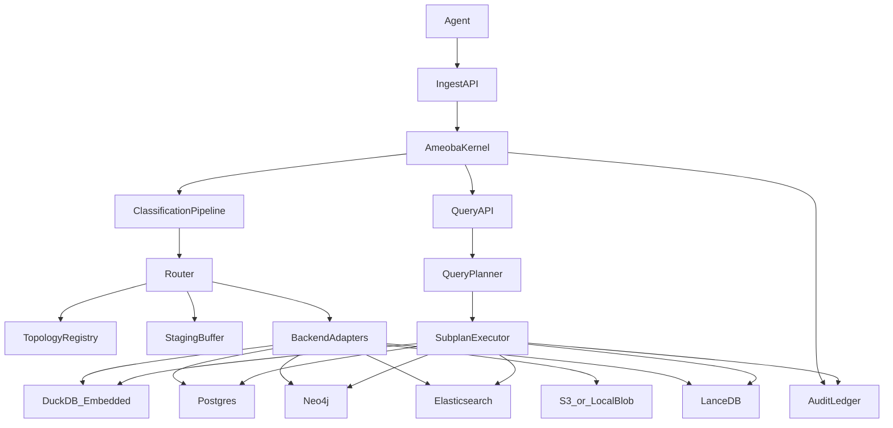

## Abstract

Agentic workflows produce heterogeneous artifacts—structured events, semi-structured documents, graphs, files, and embeddings—whose storage and governance requirements vary across access patterns, compliance constraints, and query workloads. This paper presents **Ameoba**, an adaptive data fabric that acts as an orchestration and routing layer between agents and a polyglot set of storage backends. Ameoba (i) performs **deterministic, auditable classification** of incoming payloads via a layered cascade to produce a *classification vector* rather than a single label; (ii) routes mixed payloads via **decomposition** and topology-aware backend selection; (iii) exposes a **unified SQL interface** that supports backend-native operations through table-valued functions while executing cross-backend joins in an embedded analytical engine; and (iv) maintains a **tamper-evident statement of record** via an append-only audit ledger with RFC 6962 Merkle tree integrity proofs and optional external anchoring. We describe Ameoba’s design, interfaces, and failure semantics, and propose an evaluation methodology for classification fidelity, federation overhead, and audit verification scalability. Quantitative results are left as future work and are explicitly marked as such.

## Keywords

Agentic workflows; data fabric; polyglot persistence; deterministic classification; federated query; Merkle trees; audit logging; governance

## 1. Introduction

Modern AI agents interact with many tools and produce many data types: API responses (JSON), traces and logs, extracted entities, relationship graphs, prompt and response transcripts, intermediate representations, and large binary assets (PDFs, images). In practice, organizations store these artifacts across different systems—relational databases for transactional records, document stores for text and search, graph databases for relationship traversal, object stores for blobs, and specialized vector indexes for similarity search. This **polyglot persistence** is necessary but operationally costly: developers must decide where each artifact belongs, maintain multiple ingestion paths, and reconcile queries and governance policies across backends.

Two constraints make agentic workflows distinctive:

- **Explainability and auditability of storage decisions**: routing decisions may affect compliance, retention, and access controls. Non-deterministic or opaque classification can undermine audit requirements.
- **Evolving topology**: workflows often start small (single-machine prototyping) and grow into multi-service systems. Storage should be able to evolve from embedded engines to external backends without rewriting ingestion logic.

This paper proposes Ameoba as an orchestration layer that provides a single ingest and query surface while preserving backend specialization.

### 1.1 Contributions (design contributions)

This work contributes:

- **Deterministic classification as a cascade**: a layered, cheap-to-expensive pipeline producing a probability distribution over storage categories with explainable signals (e.g., entropy, format detection, structural heuristics).
- **Mixed-record decomposition**: a routing model that can split heterogeneous payloads into sub-records routed to different backends while preserving cross-references.
- **Federated SQL with table-valued functions (TVFs)**: SQL as the lingua franca, with backend-native capabilities (graph traversal, full-text, vector search) exposed as TVFs, and cross-backend joins executed in an embedded analytical engine (DuckDB).
- **Tamper-evident statement of record**: an append-only audit ledger with hash chaining, gapless sequencing, and RFC 6962 Merkle trees for \(O(\log n)\) inclusion proofs and verification, with optional external anchoring.
- **A topology-aware microkernel architecture**: a small kernel responsible for classification, routing, and audit, with storage backends as adapters registered in a topology registry and optionally promoted from embedded to external deployments.

## 2. Background and Motivation

### 2.1 Polyglot persistence and the routing problem

Polyglot persistence selects storage technologies based on data shape and access patterns. For agentic systems, the routing problem is compounded by *heterogeneity and drift*: the same workflow may emit tabular events, nested JSON, graphs, and large files, and the schema may evolve rapidly. A practical fabric must support both rapid bootstrapping and gradual specialization.

### 2.2 Federated query

Federation systems decompose queries into backend-specific subplans, push down predicates and projections where supported, and execute remaining operations (especially joins) in a common compute layer. A key challenge is cost and correctness under partial failures and inconsistent snapshots.

### 2.3 Tamper-evident logs

Compliance requirements motivate immutable audit trails. Hash chaining provides sequential tamper evidence but can require linear verification. Merkle tree constructions (RFC 6962) support efficient inclusion proofs and scalable verification.

## 3. System Overview

Ameoba is an orchestration layer—not a database—that mediates between agents and storage backends.

### 3.1 Components

- **API layer**: HTTP and gRPC endpoints for ingest, query, and audit operations.
- **Kernel (microkernel)**: orchestrates classification, schema registry updates, routing, staging/retry, audit recording, and query planning.
- **Topology registry**: maintains descriptors and health/status for available backends (embedded and external).
- **Backend adapters**: implement store-specific write/read/query primitives and capability manifests.
- **Audit ledger**: append-only log with Merkle tree integrity verification.

### 3.2 Dataflow



### 3.3 Operational modes

Ameoba supports an embedded “start with nothing” mode where the kernel uses embedded engines for storage and auditing. As requirements grow, external backends can be registered and used for primary storage while maintaining the same ingest and query interfaces.

## 4. Deterministic Classification and Decomposition

Classification determines *what category a payload belongs to* and therefore what backend(s) should store it. Ameoba emphasizes determinism and auditability: routing decisions must be reproducible and explainable, so the primary classifier is rule-based and inference-driven rather than ML-based.

### 4.1 Categories and outputs

Let the category set be:

\[
\mathcal{C} = \{\text{relational}, \text{document}, \text{graph}, \text{blob}, \text{vector}\}.
\]

Given a payload \(x\), the classifier outputs a vector:

\[
p(c \mid x)\ \text{for all}\ c \in \mathcal{C},
\]

along with an explanation bundle (signals and thresholds) suitable for auditing.

### 4.2 Layered cascade (cheap → expensive)

The pipeline is organized as a cascade with early exits:

1. **L0: Binary/blob detection** (magic bytes, entropy, null-byte frequency, base64 detection).
2. **L1: Format detection** (JSON/CSV/XML/Parquet/Avro).
3. **L2: Structural analysis** (flatness, key consistency, nesting depth, array heterogeneity).
4. **L3: Semantic analysis** (graph motifs, domain vocabularies, schema registry matching, optional plugins).

### 4.3 Structural heuristics (examples)

Examples of deterministic signals:

- **Relational score**: high key consistency across records (e.g., Jaccard similarity above a threshold), low nesting depth, type homogeneity per inferred column, and absence of heterogeneous arrays.
- **Document score**: high nesting depth, high schema variance across records, polymorphic objects, heterogeneous arrays.
- **Graph score**: explicit node/edge patterns or triple-like structures, adjacency motifs, or strong vocabulary matches (e.g., subject/predicate/object).
- **Blob score**: recognized magic bytes or high entropy and binary features; size thresholds may force direct blob routing.
- **Vector score**: fixed-length float arrays of common embedding dimensions and vector-like field names.

### 4.4 Mixed payloads and decomposition

Payloads can contain multiple modalities (e.g., a JSON record that includes a large binary field, or a document with extracted entities and relationships). Ameoba treats classification as a *multi-label* decision and supports **decomposition**:

- split a record into sub-records \(x \to \{x_1, x_2, \dots\}\),
- route each \(x_i\) to its best backend(s),
- preserve cross-references in metadata (record IDs, content hashes, foreign keys).

### 4.5 Classifier pseudocode

```text
Algorithm 1: DeterministicClassificationCascade
Input: payload x, optional category_hint h, schema_registry R, plugin_set P
Output: classification vector p over categories, explanation E, optional parts {x_i}

1: if h is present then
2:   return OneHot(h) with confidence 1.0, explanation "explicit hint"
3: end if
4: signals <- {}
5: if IsBlob(x) using magic_bytes/entropy/null_bytes/size then
6:   return p(blob)=1.0 with signals
7: end if
8: fmt <- DetectFormat(x)  // JSON/CSV/XML/Parquet/...
9: signals.add(fmt)
10: features <- StructuralFeatures(x)  // depth, key_consistency, variance, arrays, ...
11: signals.add(features)
12: p <- SoftVote(HeuristicDetectors(features), PluginDetectors(P, x), RegistryMatch(R, x))
13: if Mixedness(p, features) is high then
14:   parts <- Decompose(x)  // extract sub-structures (e.g., embeddings, blobs, edges)
15:   return p, signals, parts
16: else
17:   return p, signals
18: end if
```

## 5. Routing, Staging, and Topology Adaptation

Routing uses the classification vector, backend capability manifests, tenant/policy constraints, and backend health to select one or more backends.

### 5.1 Topology-aware routing

Each backend publishes a descriptor including:

- categories supported (e.g., relational/document/graph/blob/vector),
- query/write capabilities (pushdown support, indexing, limits),
- operational constraints (availability, freshness, cost, latency),
- tenancy and compliance features (encryption, WORM retention, etc.).

Given \(p(c \mid x)\), the router selects a target backend set \(B(x)\) by maximizing expected utility under constraints:

\[
B(x) = \arg\max_{B \subseteq \mathcal{B}} \sum_{c \in \mathcal{C}} p(c \mid x)\ \text{Fit}(B, c)\quad \text{s.t. policy constraints},
\]

where \(\mathcal{B}\) is the set of registered backends in the topology. This paper focuses on deterministic system design rather than learning Fit; practical implementations can begin with explicit rules.

### 5.2 Staging buffer and idempotence

If a target backend is unavailable, Ameoba uses a staging buffer to queue writes with exponential backoff retry. Writes should be idempotent (e.g., content-addressed blob keys; conflict-handling for relational inserts) to safely handle retries and partial failures.

### 5.3 Topology evolution

Ameoba begins with embedded stores (e.g., embedded relational/analytics + embedded audit) and can promote categories to external backends (e.g., Postgres, Neo4j, Elasticsearch, S3, vector stores) when scale or feature requirements exceed embedded constraints. Promotion and migration policies are treated as future work.

## 6. Unified Query via Federated SQL

Ameoba exposes SQL as the user-facing query language and uses table-valued functions (TVFs) to access backend-native operations.

### 6.1 Fast path vs federation path

- **Fast path**: if a query touches a single backend, translate to that backend’s native query (e.g., SQL for relational) with minimal overhead.
- **Federation path**: if a query spans multiple backends, decompose into subplans, push down predicates and projections, execute subplans concurrently, and perform remaining joins/aggregations in a common compute engine (DuckDB).

### 6.2 TVFs as an extensibility mechanism

Examples include:

- `graph_traverse(...)` for graph traversal,
- `full_text_search(...)` for search,
- `vector_search(...)` for ANN similarity search.

TVFs avoid building a bespoke DSL while allowing access to backend-native features.

### 6.3 Join strategies (design)

For cross-backend joins, cost heuristics can select among:

- **Batched nested-loop**: small outer relation with indexed inner lookups.
- **Hash join in compute engine**: load both sides and join in DuckDB.
- **Semi-join with Bloom filters / key filtering**: push candidate keys to the larger side to reduce transferred data.

### 6.4 Consistency and failure semantics

Ameoba’s federated queries provide **snapshot-approximate** semantics: each backend executes with its best available snapshot, but there is no global distributed snapshot guarantee. Partial failures can be treated as fail-fast for joins (to avoid silent wrong results) and as degradable for UNION-like aggregations.

### 6.5 Federated planner pseudocode

```text
Algorithm 2: FederatedSQLPlanningAndExecution
Input: SQL query q, topology registry T, capability manifests M
Output: result table R or error

1: logical_plan <- ParseAndRewrite(q)
2: backends <- ResolveRelations(logical_plan, T)
3: if |backends| == 1 then
4:   return ExecuteNative(backends[0], logical_plan)
5: end if
6: subplans <- Decompose(logical_plan, backends, M)
7: for each subplan s in subplans do in parallel
8:   rs[s] <- ExecuteNative(BackendOf(s), Pushdown(s, M))
9: end for
10: temp_tables <- LoadIntoComputeEngine(rs)  // e.g., Arrow -> DuckDB temps
11: final_plan <- ReplaceLeavesWithTemps(logical_plan, temp_tables)
12: return ExecuteInComputeEngine(final_plan)
```

## 7. Audit and Compliance: Tamper-Evident Statement of Record

Every operation (ingest, classification, routing, writes, reads, queries, schema changes, backend health events) is recorded to an append-only audit ledger.

### 7.1 Append-only enforcement and tamper evidence

The audit ledger enforces immutability via multiple layers:

- **Access control**: roles that do not permit UPDATE/DELETE.
- **Database triggers**: raise on UPDATE/DELETE as defense in depth.
- **Gapless sequencing**: detects missing entries.
- **Hash chaining**: each entry includes the previous entry’s hash.

### 7.2 RFC 6962 Merkle trees

To support efficient verification at scale, Ameoba uses an RFC 6962 Merkle tree construction for the audit log, enabling \(O(\log n)\) inclusion proofs. This allows auditors or independent verifiers to validate that a particular event is included without scanning the entire log.

### 7.3 External anchoring (optional)

To mitigate the “DBA can tamper” threat model, Ameoba can periodically anchor Merkle roots to an external tamper-resistant store (e.g., WORM object storage). A separate verifier process can recompute and check anchored digests.

## 8. Security and Governance

Ameoba targets multi-agent environments and treats both programmatic agents and human operators as first-class clients.

### 8.1 Identity and authentication

Common mechanisms include API keys for development and JWT/OAuth2 for production. Agent identity is modeled as an accountable principal, optionally with session identifiers for audit correlation.

### 8.2 Authorization via policy evaluation

Authorization can be performed at the Ameoba layer (an “authorization gateway” pattern) using Cedar-compatible policies. Policies incorporate:

- scopes (read/write/admin),
- tenant isolation,
- data labels (e.g., PII/PHI/PCI),
- delegation (agent-to-agent) with bounded depth.

### 8.3 Label propagation

Labels can be inferred from payload features (e.g., field names and pattern detectors) and are treated as additive constraints. In federated queries, results inherit the most restrictive label among joined sources.

## 9. Implementation Notes (Prototype)

The current system is implemented as an async-first Python kernel with both HTTP and gRPC interfaces, designed to run in a fully embedded configuration (embedded relational/analytics engine plus an embedded audit ledger and local blob storage) and to optionally register external backends (relational, document, graph, blob, vector) via adapter interfaces.

This section is intentionally descriptive and avoids performance and completeness claims.

## 10. Evaluation (methodology; results are future work)

This section specifies evaluation goals and methodology. **All quantitative results are intentionally omitted and must be measured in future work**.

### 10.1 Classification fidelity

- **Goal**: verify that deterministic signals route payloads to appropriate categories under schema drift and mixed payloads.
- **Datasets** (to be assembled):
  - synthetic mixtures of flat JSON, nested JSON, graph-shaped payloads, and binary artifacts;
  - real-world agent traces (sanitized), logs, and documents with labeled ground truth categories.
- **Metrics**:
  - top-1 accuracy and calibration (ECE) for category selection,
  - mixed-record decomposition correctness (precision/recall on extracted sub-records),
  - explainability completeness (fraction of decisions with sufficient signal bundle).
- **Baselines**:
  - single-label rule-based classifier without probabilistic output,
  - a naive “everything is document” router as a lower bound.

### 10.2 Federated query overhead and pushdown effectiveness

- **Goal**: quantify additional latency and data transfer caused by federation and validate the effectiveness of predicate/projection pushdown.
- **Workloads**:
  - single-backend queries (fast path),
  - two-backend joins (e.g., relational + search),
  - three-backend pipelines (e.g., vector search candidates joined with relational metadata and filtered via search).
- **Metrics**:
  - end-to-end latency, bytes transferred, and intermediate materialization size,
  - fraction of operators pushed down per backend.
- **Comparisons**:
  - join strategies (hash join vs batched nested loop vs semi-join).

### 10.3 Audit verification scalability

- **Goal**: evaluate the cost of continuous integrity verification as the audit log grows.
- **Metrics**:
  - Merkle root update cost per appended event,
  - inclusion proof generation and verification latency,
  - full-ledger verification time under partitioning/segmentation strategies.

### 10.4 Resilience under backend failures

- **Goal**: measure staging buffer behavior and correctness during backend outages and recovery.
- **Metrics**:
  - queued write depth, retry success time distribution,
  - duplicate-write rate (should be near zero under idempotence),
  - end-to-end durability of ingested records.

## 11. Related Work (conservative; non-exhaustive)

This section only references systems and sources explicitly named in the project’s reference materials.

- **Content-based routing and classification**: Apache NiFi and Apache Atlas motivate practical approaches to data classification and routing, emphasizing provenance and governance integration.
- **Schema inference for semi-structured data**: Baazizi et al. (EDBT 2017) study JSON schema inference, aligning with Ameoba’s versioned schema registry and drift detection approach.
- **Polyglot persistence selection**: Souza et al. (2021) discuss selecting storage technologies based on data and access patterns; Ameoba operationalizes this as a deterministic classifier + router rather than manual per-service decisions.
- **Federated query and connector architectures**: Trino and Apache Calcite provide reference designs for connector SPIs and logical planning; Ameoba’s novelty lies in using SQL + TVFs and a lightweight embedded compute engine for cross-backend joins, emphasizing agent-oriented extensibility.
- **Tamper-evident audit logs**: RFC 6962 (Certificate Transparency) establishes Merkle tree constructions for efficient inclusion proofs, which Ameoba adapts to auditing in agentic workflows.
- **CRDT-based availability mechanisms**: Production CRDT systems (e.g., Riak; Automerge) and research on log-structured CRDTs motivate designs where some metadata converges under partition while ordered audit trails require sequencing.

## 12. Discussion, Limitations, and Future Work

### 12.1 Limitations

- **No global snapshot consistency**: federation provides snapshot-approximate semantics; cross-backend queries may reflect different backend snapshots.
- **Operational complexity**: polyglot systems are inherently complex; the fabric reduces application complexity but does not eliminate operational burden.
- **Migration and promotion policies**: while topology can evolve, robust policies for migrating data between embedded and external backends are not yet specified here.
- **Provisioning protocols**: interfaces between the fabric and external provisioning agents are an open design area.

### 12.2 Future work

- Implement and evaluate a full provisioning protocol for external backends and staged promotion.
- Add benchmark suites for classification fidelity, query federation overhead, and audit verification at scale.
- Explore automated statistics collection and cost modeling to improve join strategy selection.
- Formalize security proofs for label propagation and policy enforcement across federated subplans.

## References

The following references are named in the project’s reference documents and are listed here as pointers rather than a complete bibliography:

- RFC 6962: Certificate Transparency (Merkle tree audit logs).
- Baazizi et al., EDBT 2017: JSON schema inference.
- Souza et al., 2021: Polyglot persistence selection and criteria.
- Apache NiFi; Apache Atlas: content-based routing and classification/governance.
- Trino; Apache Calcite (arXiv:1802.10233): federated query planning and connector architectures.
- CRDT references: Riak CRDTs; Automerge; log-structured CRDTs (UCSB research); SoundCloud Roshi (timestamped event sets).

